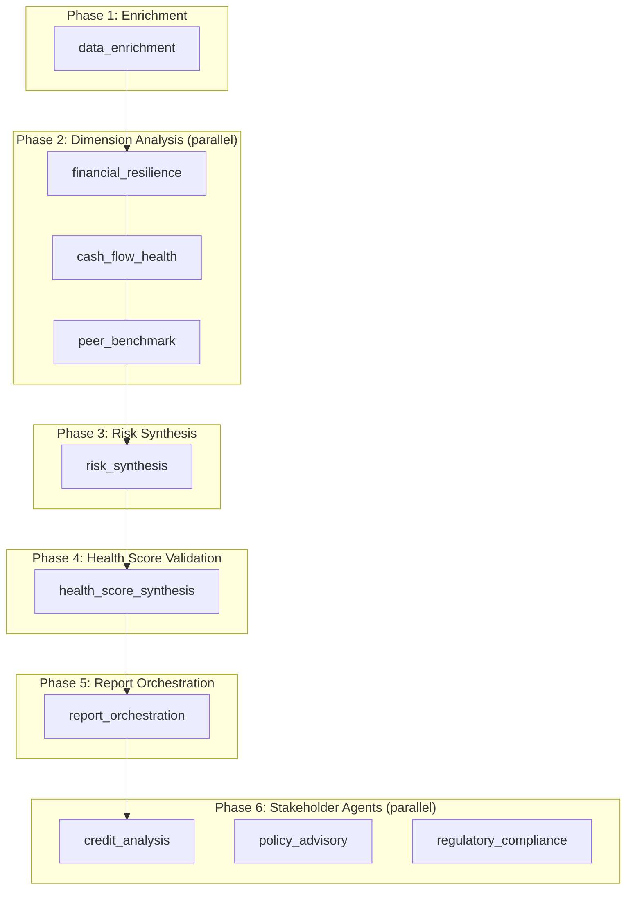

# Agentic AI Architecture

Multi-phase agentic orchestration for the 20-dimension Financial Health Score platform.

## Overview

Every assessment triggers **27 AI agents** across **6 orchestration phases**:



## Per-Dimension Agents (20)

Each scoring dimension has a dedicated agent with a specialized role:

| Dimension | Agent Role | Weight |
|---|---|---|
| financial_resilience | Liquidity & leverage analyst | 9% |
| founder_capability | Key-person risk analyst | 8% |
| cash_flow_health | Cash flow analyst | 7% |
| payment_behaviour | Payment behaviour analyst | 7% |
| credit_history_debt_servicing | Credit bureau analyst | 6% |
| operational_stability | Operations analyst | 6% |
| legal_compliance | Legal compliance analyst | 6% |
| carbon_transition_risk | Carbon transition analyst | 5% |
| alternative_data_signals | Alternative data analyst | 5% |
| market_sentiment | Market sentiment analyst | 5% |
| tax_compliance | Tax compliance analyst | 4% |
| operational_certifications | Certification analyst | 4% |
| government_policy_alignment | Policy alignment analyst | 4% |
| product_demand_outlook | Demand forecast analyst | 4% |
| esg_disclosure | ESG disclosure analyst | 4% |
| supply_chain_resilience | Supply chain stress analyst | 4% |
| governance_diversity | Governance analyst | 3% |
| insurance_business_continuity | Insurance adequacy analyst | 3% |
| geographic_risk | Geographic risk analyst | 3% |
| peer_benchmark | Peer benchmarking analyst | 3% |

### Dimension Agent Output

Each dimension agent produces:

- `score` / `weighted_contribution` — contribution to overall score
- `risk_flags` — dimension-specific risk triggers
- `positive_signals` / `negative_signals` — evidence counts
- `summary` — agent narrative (LLM-enhanced when `OPENAI_API_KEY` set)
- `recommendations` — actionable improvements

## Synthesis Agents

### Risk Synthesis Agent

Aggregates all 20 dimension agents into a composite risk profile:

- `composite_risk_level` — low / moderate / elevated / high / critical
- `flagged_dimensions` — dimensions below thresholds
- `mitigation_priorities` — ordered remediation actions
- Aligns with system `risk_indicators`

### Health Score Synthesis Agent

Validates the computed Financial Health Score:

- Recomputes weighted sum from dimension agent contributions
- Applies governance diversity bonus
- Validates score delta tolerance
- Flags low-confidence dimensions affecting score integrity

### Report Orchestration Agent

Generates the final credit assessment report:

- Executive summary (LLM-enhanced)
- Credit decision recommendation
- Stakeholder-specific summaries (bank, MSME, government, regulatory)
- 9 report sections

## API Endpoints

| Method | Path | Description |
|---|---|---|
| `GET` | `/api/v1/agents/architecture` | Orchestration architecture metadata |
| `GET` | `/api/v1/agents/status` | Agent run counts (optional `?assessment_id=`) |
| `POST` | `/api/v1/agents/orchestrate/{assessment_id}` | Re-run full orchestration |
| `GET` | `/api/v1/agents/orchestration/{orchestration_id}` | Retrieve orchestration result |
| `GET` | `/api/v1/agents/dimension/{dimension_id}?assessment_id=` | Single dimension agent output |

## Orchestration Result Structure

```json
{
  "orchestration_id": "uuid",
  "assessment_id": "uuid",
  "phases": [{ "phase": "dimension_analysis", "agents_run": 20, "duration_ms": 45 }],
  "dimension_agents": [{ "dimension": "tax_compliance", "score": 93.6, "agent_summary": "..." }],
  "risk_synthesis": { "composite_risk_level": "low", "mitigation_priorities": [] },
  "health_score": { "computed_score": 78.1, "agent_validated_score": 78.1 },
  "reporting": { "executive_summary": "...", "credit_decision": "CONDITIONAL APPROVAL" },
  "summary": { "total_agents_run": 27, "top_strengths": [], "top_risks": [] }
}
```

## Configuration

```env
OPENAI_API_KEY=sk-...    # Optional — enables LLM-enhanced agent narratives
```

Without OpenAI, all agents use deterministic rule-based intelligence with identical structure.

## File Structure

```
server/src/services/agents/
├── catalog.ts           # 20-dimension agent definitions
├── types.ts             # Agent result types
├── orchestrator.ts      # Multi-phase orchestration engine
├── dimension-agent.ts   # Per-dimension agent runner
├── legacy-agents.ts     # Stakeholder agents (credit, policy, regulatory)
├── logger.ts            # Agent run persistence
├── synthesis/
│   ├── risk.ts          # Risk synthesis agent
│   ├── health-score.ts  # Health score validation agent
│   └── report.ts        # Report orchestration agent
└── index.ts             # Public exports
```
