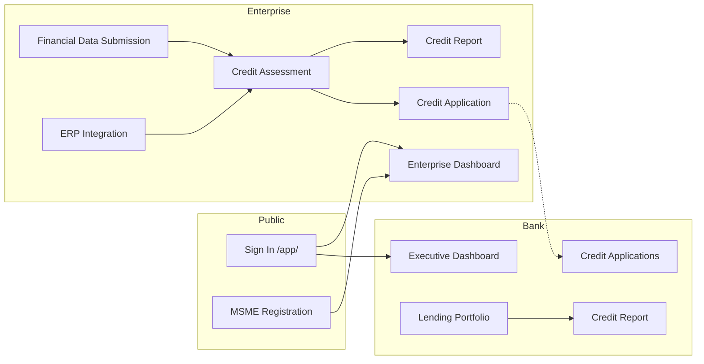

# Application Snapshots

Live snapshot catalogue of the **Financial Health Score (FHS)** platform — React TypeScript UI routes, stakeholder portals, and representative API payloads.

| | |
|---|---|
| **Generated** | 2026-07-08T12:22:58.280Z |
| **Platform** | Financial Health Score v2.1.0 |
| **Stack** | Node.js Express API + React TypeScript SPA |
| **UI base** | `/app/` |
| **API base** | `http://localhost:8080` |

Machine-readable export: [snapshots/application-snapshots.json](./snapshots/application-snapshots.json)

Regenerate: `cd server && npm run collect:app-snapshots`

Related: [APPLICATION_UI_SNAPSHOTS.md](./APPLICATION_UI_SNAPSHOTS.md) (visual screenshots) · [PRODUCT_SNAPSHOTS.md](./PRODUCT_SNAPSHOTS.md) (API golden files) · [PLATFORM.md](./PLATFORM.md) · [TERMINOLOGY.md](./TERMINOLOGY.md)

---

## Platform Snapshot

```json
{
  "status": "healthy",
  "version": "2.1.0",
  "server": "nodejs",
  "carbon_intelligence_connected": false,
  "mock_mode": true,
  "integrations_mock_mode": true,
  "dimension_count": 20,
  "ai_agents_enabled": true,
  "agentic_orchestration": true,
  "dimension_agents": 20,
  "openai_configured": false
}
```

| Capability | Value |
|---|---|
| Scoring dimensions | 20 |
| AI agents (full pipeline) | 27 per assessment |
| Scoring engine | Node.js (default) |
| UI | React 19 + TypeScript SPA |
| Integrations | Mock mode (demo) |

---

## Demo Credentials Snapshot

| Portal | Email | Password | Role |
|---|---|---|---|
| Lending Institution | `credit@idbi.bank.in` | `IDBI@2026` | Credit Analyst |
| Enterprise (MSME) | `rajesh@shreeganesh.in` | `MSME@2026` | Enterprise Proprietor |
| Government | `admin@msme.gov.in` | `GOVT@2026` | Ministry Administrator |
| Regulatory | `supervisor@rbi.org.in` | `REG@2026` | RBI Supervisory Officer |

Full list: `GET /api/v1/auth/demo-credentials`

---

## UI Route Catalogue

### Public routes

| Route | Page | Description |
|---|---|---|
| `/app/` | Secure Sign In | Stakeholder authentication with demo credentials |
| `/app/msme/register` | MSME Enterprise Registration | 3-step onboarding wizard |

### Lending Institution Portal

| Route | Page | Primary API |
|---|---|---|
| `/app/bank/dashboard` | Executive Dashboard | `GET /api/v1/bank/dashboard` |
| `/app/bank/portfolio` | MSME Lending Portfolio | `GET /api/v1/bank/portfolio` |
| `/app/bank/loans` | Credit Applications | `GET /api/v1/bank/loans` |
| `/app/bank/report?id=` | MSME Credit Assessment Report | `GET /api/v1/reports/{id}` |

### Enterprise Portal (MSME)

| Route | Page | Primary API |
|---|---|---|
| `/app/msme/dashboard` | Enterprise Dashboard | `GET /api/v1/msme/dashboard` |
| `/app/msme/profile` | Financial Data Submission | `GET/POST /api/v1/msme/profile`, `POST /api/v1/msme/data-feed` |
| `/app/msme/import` | ERP Data Integration | `POST /api/v1/msme/assess/import` |
| `/app/msme/assess` | Credit Assessment | `POST /api/v1/msme/assess/quick` |
| `/app/msme/report` | Credit Assessment Report | `GET /api/v1/reports/{id}` |
| `/app/msme/loans` | Credit Applications | `GET /api/v1/msme/loans` |

### Government Portal

| Route | Page | Primary API |
|---|---|---|
| `/app/govt/dashboard` | National MSME Dashboard | `GET /api/v1/govt/dashboard` |
| `/app/govt/schemes` | Scheme Advisory | `POST /api/v1/govt/schemes/recommend/{msme_id}` |

### Regulatory Portal

| Route | Page | Primary API |
|---|---|---|
| `/app/regulatory/dashboard` | Supervisory Dashboard | `GET /api/v1/regulatory/dashboard` |
| `/app/regulatory/review` | Compliance Review | `POST /api/v1/regulatory/review/{msme_id}` |

---

## Demo MSME — Credit Assessment Snapshot

**Enterprise:** Shree Ganesh Auto Components Pvt Ltd (`msme-demo-001`)

```json
{
  "assessment_id": "c9033abc-b0d0-4235-8ead-09f64417d616",
  "business_name": "Shree Ganesh Auto Components Pvt Ltd",
  "msme_id": "msme-demo-001",
  "overall_score": 78.1,
  "grade": "B+",
  "overall_risk_level": "low",
  "overall_confidence": "high",
  "created_at": "2026-07-08T12:22:58.212Z",
  "dimension_count": 20
}
```

| Metric | Value |
|---|---|
| Financial Health Score (FHS) | **78.1** |
| Credit Grade | **B+** |
| Credit Risk Rating | low (Low Credit Risk) |
| Dimensions evaluated | 20 |

---

## Lending Institution Portal Snapshots

### Executive Dashboard

```json
{
  "portfolio_count": 15,
  "assessments_this_month": 229,
  "average_score": 63,
  "high_risk_count": 0,
  "pending_loans": 0,
  "approved_loans_inr": 31500000
}
```

| Stat | Value |
|---|---|
| Portfolio MSMEs | 15 |
| Portfolio Avg. FHS | 63 |
| Assessments (MTD) | 229 |
| Sanctioned (INR) | ₹315.0 L |

### MSME Lending Portfolio (sample)

| Enterprise | Sector | FHS | Grade | Risk |
| --- | --- | --- | --- | --- |
| Feed Test Industries | textiles | 61.5 | B | moderate |
| Feed Test Industries | textiles | 61.5 | B | moderate |
| Feed Test Industries | textiles | 61.5 | B | moderate |
| Feed Test Industries | textiles | 61.5 | B | moderate |
| Feed Test Industries | textiles | 61.5 | B | moderate |

### Credit Applications (sample)

| Ref. | Enterprise | Facility | Amount | Status |
| --- | --- | --- | --- | --- |
| LN-1783512936836-A14996 | Shree Ganesh Auto Components Pvt Ltd | working_capital | ₹15,00,000 | approved |
| LN-1783512891070-32FA2C | Shree Ganesh Auto Components Pvt Ltd | working_capital | ₹15,00,000 | approved |
| LN-1783511046545-C59DC3 | Shree Ganesh Auto Components Pvt Ltd | working_capital | ₹15,00,000 | approved |

---

## Enterprise Portal Snapshots

### Enterprise Dashboard

```json
{
  "msme_id": "msme-demo-001",
  "business_name": "Shree Ganesh Auto Components Pvt Ltd",
  "latest_score": 78.1,
  "latest_grade": "B+",
  "latest_risk_level": "low",
  "last_assessed_at": "2026-07-08 12:15:36",
  "open_loan_applications": 0,
  "unread_notifications": 21,
  "improvement_count": 8,
  "profile_completeness": 20,
  "has_profile_data": false
}
```

### Enterprise Profile (sample)

```json
{
  "msme_id": "msme-demo-001",
  "organization_id": 2,
  "business_name": "Shree Ganesh Auto Components Pvt Ltd",
  "sector": "auto_components",
  "gstin": "27AABCS1234F1Z5",
  "pan": null,
  "udyam_number": "UDYAM-MH-12-0012345",
  "state": null,
  "pincode": null,
  "employee_count": null,
  "years_in_operation": null,
  "annual_turnover_inr": null,
  "financial_data": {},
  "data_completeness_pct": 20,
  "last_feed_at": null,
  "created_at": "2026-07-08T12:22:58.300Z",
  "updated_at": "2026-07-08T12:22:58.300Z"
}
```

### Credit Assessment History (sample)

| Date | FHS | Grade | Risk | Assessment ID |
| --- | --- | --- | --- | --- |
| 2026-07-08 | 78.1 | B+ | low | 118d51e6… |
| 2026-07-08 | 78.1 | B+ | low | 361c70b5… |
| 2026-07-08 | 78.1 | B+ | low | 4d4b0945… |

### ERP Connectors

| Connector | Mode |
| --- | --- |
| Tally ERP / TallyPrime | Demo |
| Zoho Books | Demo |
| Sustainow Carbon Intelligence | Demo |

---

## Government Portal Snapshots

### National MSME Dashboard

| Stat | Value |
|---|---|
| Registered MSMEs | 15 |
| Scheme Applications | 0 |
| Portfolio Avg. FHS | 62 |

### Registered MSMEs (sample)

| Enterprise | Sector | FHS | Grade |
| --- | --- | --- | --- |
| Feed Test Industries | textiles | 61.5 | B |
| Feed Test Industries | textiles | 61.5 | B |
| Feed Test Industries | textiles | 61.5 | B |
| Feed Test Industries | textiles | 61.5 | B |
| Feed Test Industries | textiles | 61.5 | B |

### Schemes Catalogue (sample)

- UDYAM
- CGTMSE
- PMMY
- PLI_AUTO
- CLCSS
- SAMADHAN
- ZED
- MUDRA

---

## Regulatory Portal Snapshot

### Supervisory Dashboard

| Stat | Value |
|---|---|
| Pending Reviews | 0 |
| Elevated-Risk MSMEs | 0 |
| Regulatory Submissions | 26 |

---

## User Journey Snapshots



---

## Full Route Index

```json
{
  "sign_in": "/app/",
  "msme_register": "/app/msme/register",
  "bank": [
    "/app/bank/dashboard",
    "/app/bank/portfolio",
    "/app/bank/loans",
    "/app/bank/report"
  ],
  "msme": [
    "/app/msme/dashboard",
    "/app/msme/profile",
    "/app/msme/import",
    "/app/msme/assess",
    "/app/msme/report",
    "/app/msme/loans"
  ],
  "govt": [
    "/app/govt/dashboard",
    "/app/govt/schemes"
  ],
  "regulatory": [
    "/app/regulatory/dashboard",
    "/app/regulatory/review"
  ]
}
```
