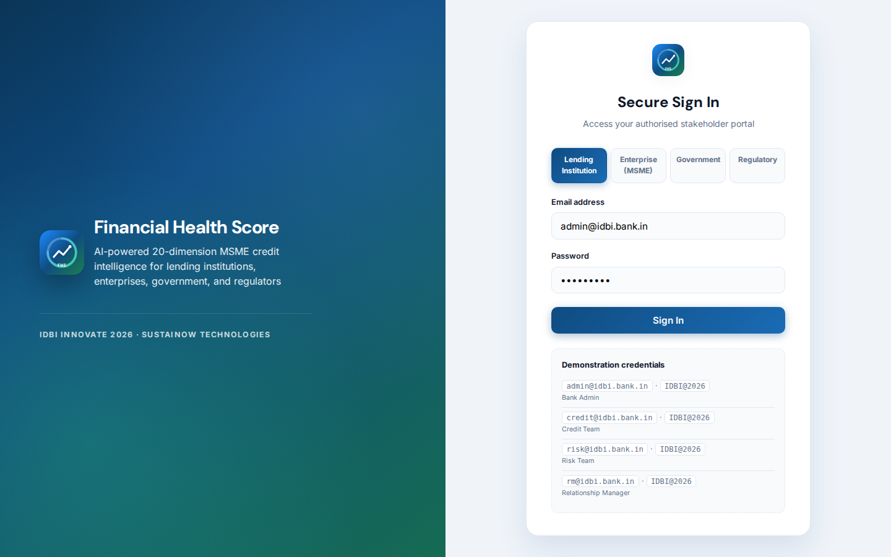
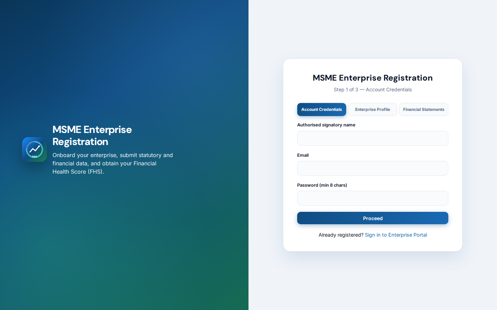
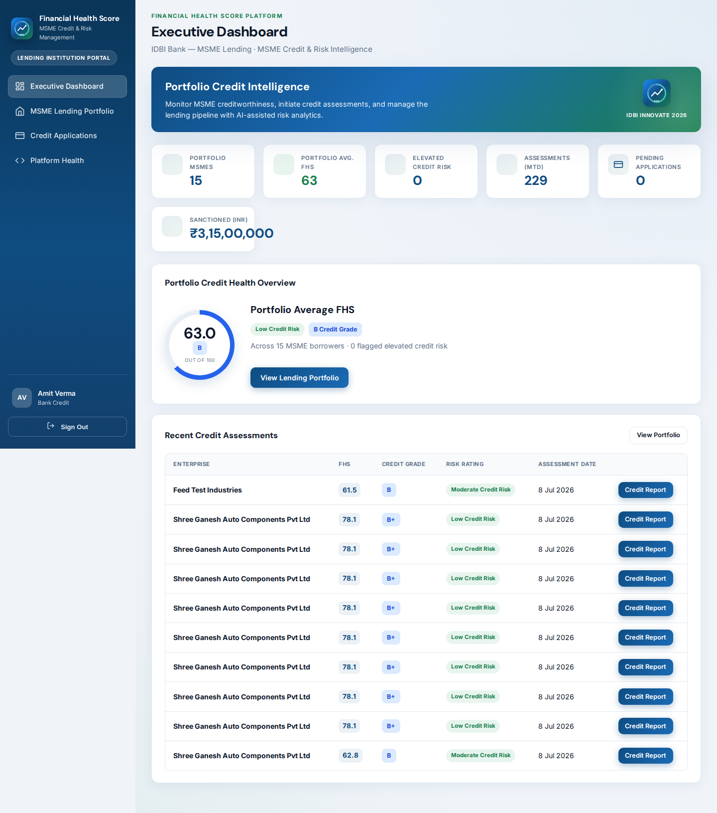
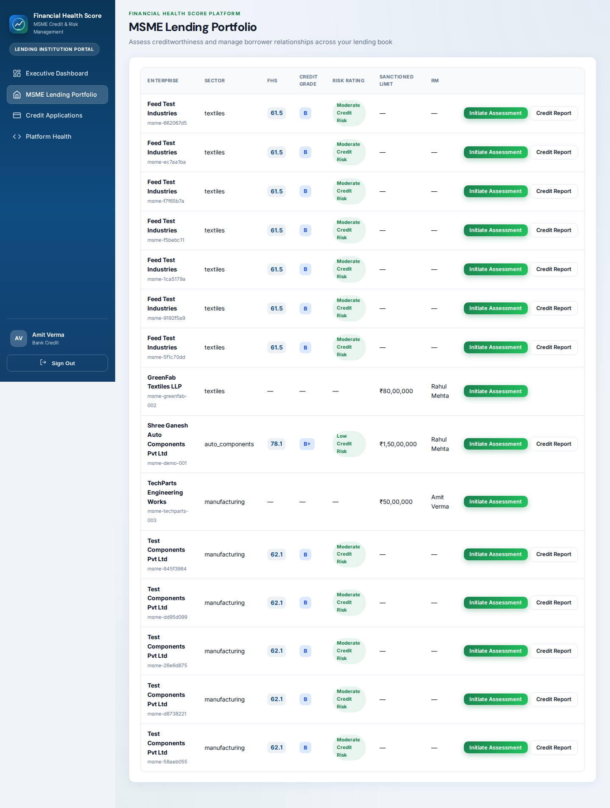
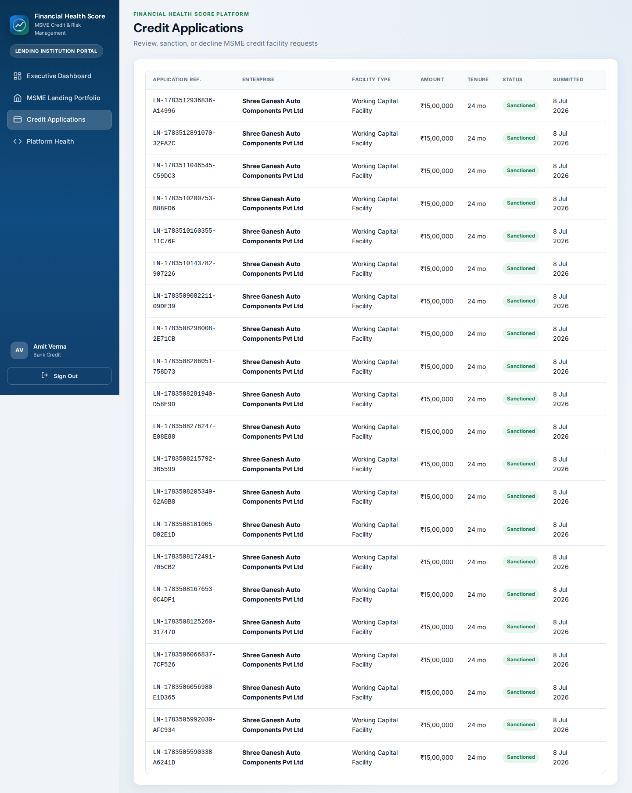
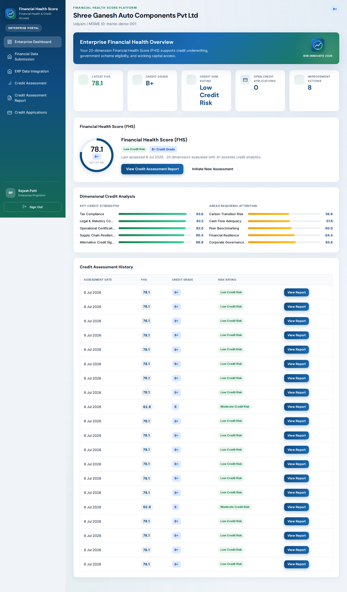
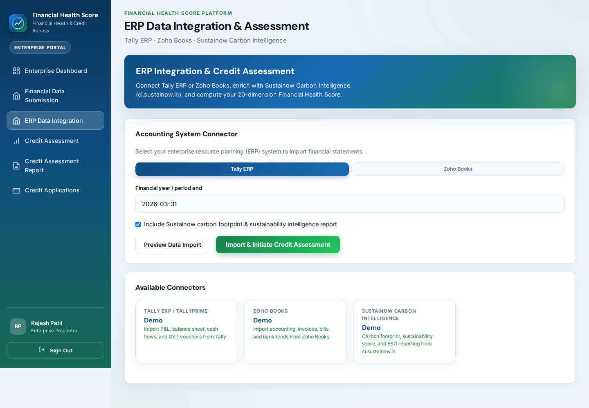
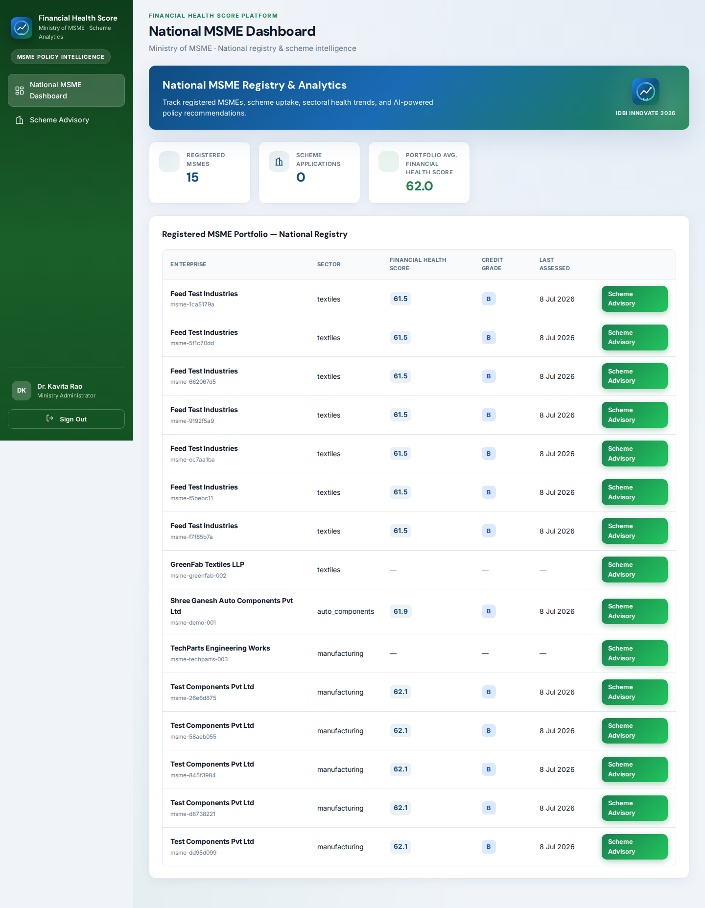

# Application UI Snapshots

Visual screenshots of the **Financial Health Score (FHS)** React application — all stakeholder portals captured at **1440×900** viewport.

| | |
|---|---|
| **Generated** | 2026-07-08T12:29:46.108Z |
| **Platform** | Financial Health Score v2.1.0 |
| **UI** | React 19 + TypeScript SPA |
| **Images** | `docs/snapshots/images/` |

Regenerate images: `cd server && npm run capture:ui-snapshots`

Data snapshots (API payloads): [APPLICATION_SNAPSHOTS.md](./APPLICATION_SNAPSHOTS.md)

---

## Public

### Secure Sign In

**Route:** `/app/`

### MSME Enterprise Registration

**Route:** `/app/msme/register`

## Lending Institution

### Executive Dashboard

**Route:** `/app/bank/dashboard`

### MSME Lending Portfolio

**Route:** `/app/bank/portfolio`

### Credit Applications

**Route:** `/app/bank/loans`

## Enterprise (MSME)

### Enterprise Dashboard

**Route:** `/app/msme/dashboard`

### Financial Data Submission

**Route:** `/app/msme/profile`

### Credit Assessment

**Route:** `/app/msme/assess`

### ERP Data Integration

**Route:** `/app/msme/import`

## Government

### National MSME Dashboard

**Route:** `/app/govt/dashboard`

## Regulatory

### Supervisory Dashboard

**Route:** `/app/regulatory/dashboard`

---

## Capture Index

| # | Portal | Page | Route | Image |
|---|---|---|---|---|
| 01 | Public | Secure Sign In | `/app/` | [01-login.png](./snapshots/images/01-login.png) |
| 02 | Public | MSME Enterprise Registration | `/app/msme/register` | [02-msme-register.png](./snapshots/images/02-msme-register.png) |
| 03 | Lending Institution | Executive Dashboard | `/app/bank/dashboard` | [03-bank-dashboard.png](./snapshots/images/03-bank-dashboard.png) |
| 04 | Lending Institution | MSME Lending Portfolio | `/app/bank/portfolio` | [04-bank-portfolio.png](./snapshots/images/04-bank-portfolio.png) |
| 05 | Lending Institution | Credit Applications | `/app/bank/loans` | [05-bank-loans.png](./snapshots/images/05-bank-loans.png) |
| 06 | Enterprise (MSME) | Enterprise Dashboard | `/app/msme/dashboard` | [06-msme-dashboard.png](./snapshots/images/06-msme-dashboard.png) |
| 07 | Enterprise (MSME) | Financial Data Submission | `/app/msme/profile` | [07-msme-profile.png](./snapshots/images/07-msme-profile.png) |
| 08 | Enterprise (MSME) | Credit Assessment | `/app/msme/assess` | [08-msme-assess.png](./snapshots/images/08-msme-assess.png) |
| 09 | Enterprise (MSME) | ERP Data Integration | `/app/msme/import` | [09-msme-import.png](./snapshots/images/09-msme-import.png) |
| 10 | Government | National MSME Dashboard | `/app/govt/dashboard` | [10-govt-dashboard.png](./snapshots/images/10-govt-dashboard.png) |
| 11 | Regulatory | Supervisory Dashboard | `/app/regulatory/dashboard` | [11-regulatory-dashboard.png](./snapshots/images/11-regulatory-dashboard.png) |
