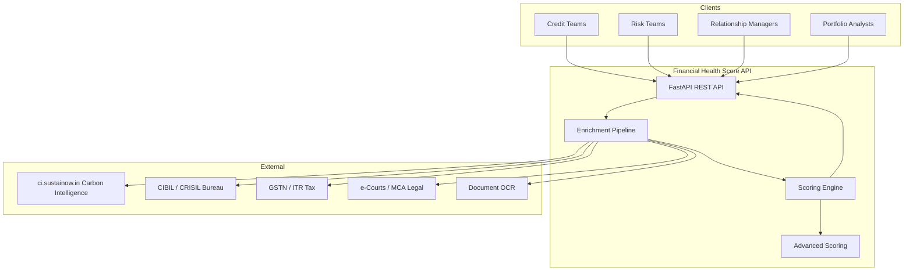
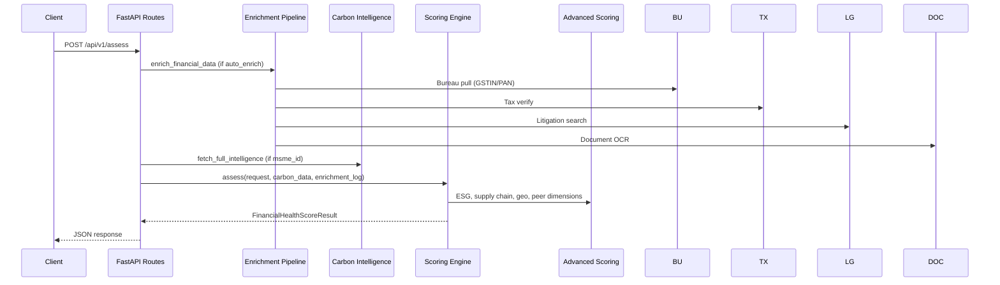
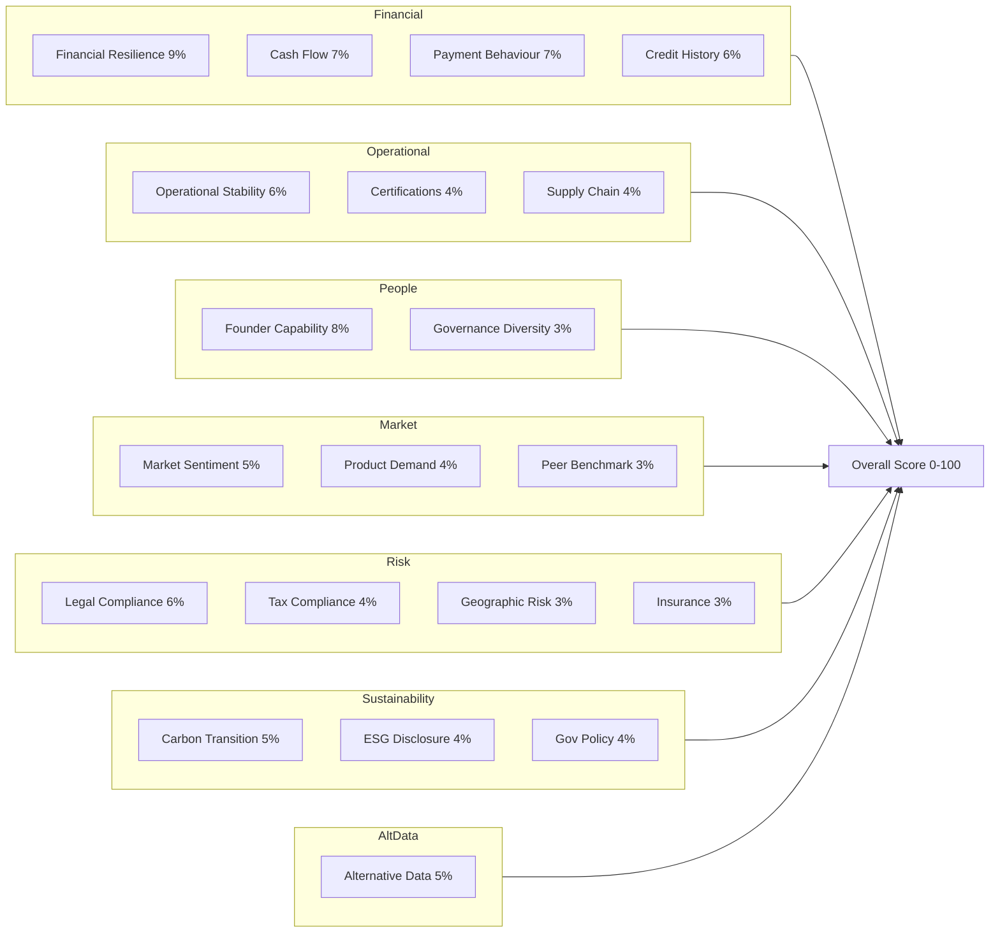
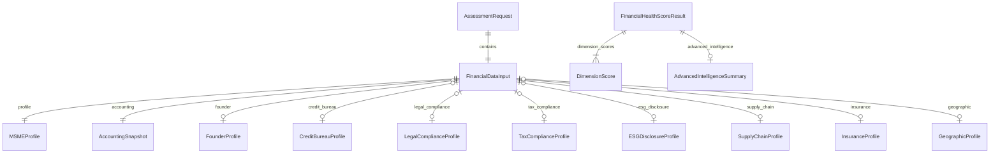

# Architecture

Financial Health Score is a **FastAPI** service that ingests consented MSME financial, operational, and alternative data, enriches it via external integrations, and produces an explainable **20-dimension Financial Health Score** for credit, risk, and relationship management teams.

Developed for **IDBI Innovate 2026** by SUSTAINOW TECHNOLOGIES.

## System Context



## Request Flow



## Component Map

| Layer | Module | Responsibility |
|---|---|---|
| **API** | `app/api/routes.py` | REST endpoints, orchestration |
| **Models** | `app/models/schemas.py` | Pydantic request/response schemas |
| **Config** | `app/config.py` | Environment settings, API keys |
| **Scoring** | `app/services/scoring_engine.py` | 15 core dimension scorers |
| **Advanced** | `app/services/advanced_scoring.py` | 5 advanced dimension scorers |
| **Enrichment** | `app/services/enrichment.py` | Auto-fetch bureau/tax/legal/OCR |
| **Integrations** | `app/services/integrations.py` | External API clients |
| **Carbon** | `app/services/carbon_intelligence.py` | ci.sustainow.in client |
| **Credit** | `app/services/credit_ratings.py` | CRISIL rating mapping |
| **Data** | `app/data/*` | Benchmarks, policies, certifications, demo MSME |

## Scoring Architecture

The overall score is a **weighted composite** of 20 dimensions (weights sum to 1.0):

```
Overall Score = Σ (dimension_score × weight) + governance_bonus
```



### Dimension Groups

| Group | Dimensions | Combined Weight |
|---|---|---|
| Financial Core | resilience, cash flow, payment, credit history | 29% |
| Operational | stability, certifications, supply chain | 14% |
| People & Governance | founder, governance diversity | 11% |
| Market & Demand | sentiment, product demand, peer benchmark | 12% |
| Compliance & Risk | legal, tax, geographic, insurance | 16% |
| Sustainability | carbon, ESG, government policy | 13% |
| Alternative Data | concentration, bank signals | 5% |

## Data Model



## Integration Modes

| Integration | Mock Trigger | Live Trigger |
|---|---|---|
| Carbon Intelligence | No `CARBON_INTELLIGENCE_API_KEY` | `ci_live_*` key set |
| Credit Bureau | `USE_MOCK_INTEGRATIONS=true` | `CREDIT_BUREAU_API_KEY` set |
| Tax Verification | `USE_MOCK_INTEGRATIONS=true` | `TAX_API_KEY` set |
| Legal Search | `USE_MOCK_INTEGRATIONS=true` | `LEGAL_API_KEY` set |
| Document OCR | `USE_MOCK_INTEGRATIONS=true` | `DOCUMENT_API_KEY` set |

## Response Structure

Every assessment returns:

| Field | Description |
|---|---|
| `overall_score` | Weighted 0–100 composite |
| `grade` | Letter grade A+ to F |
| `dimension_scores` | 20 scored dimensions with insights |
| `risk_indicators` | Actionable risk flags |
| `key_insights` | Top narrative insights |
| `data_gaps` | Missing inputs with severity |
| `recommended_improvements` | Actionable recommendations |
| `advanced_intelligence` | Integration status, peer percentile |
| `carbon_intelligence` | ci.sustainow.in summary |
| `government_policy_assessment` | Scheme enrollment analysis |
| `metadata` | Sources, enrichment log, bonuses |

## Deployment

```bash
pip install -r requirements.txt
cp .env.example .env
python run.py          # Development
# or
uvicorn app.main:app --host 0.0.0.0 --port 8080
```

Health check: `GET /api/v1/health`  
OpenAPI docs: `GET /docs`

## Testing Strategy

| Suite | File | Coverage |
|---|---|---|
| Unit scoring | `tests/test_scoring.py` | Dimension scorers, engine |
| Advanced | `tests/test_advanced.py` | ESG, peer, geo, supply chain |
| Integrations | `tests/test_integrations.py` | Bureau, tax, legal, OCR clients |
| API | `tests/test_api_assess.py` | Assessment endpoints |
| Snapshots | `tests/test_snapshots.py` | Golden-file regression |

Regenerate snapshots: `python scripts/generate_snapshots.py`
