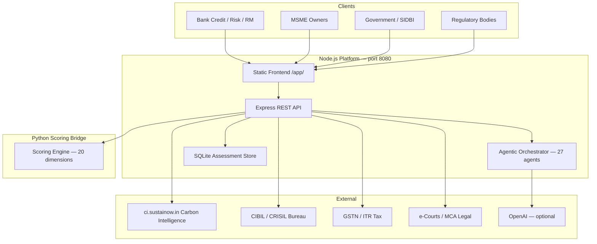
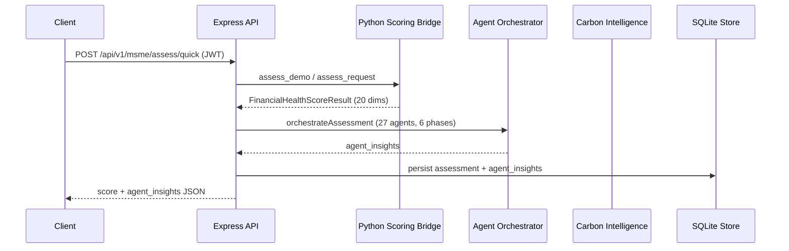
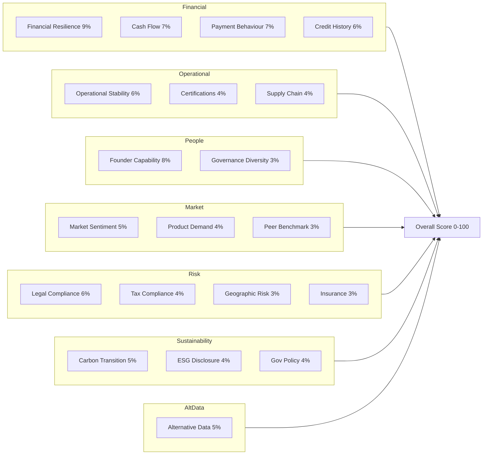

# Architecture

Financial Health Score is a **Node.js Express** platform (v2.1) that ingests consented MSME financial, operational, and alternative data, enriches it via external integrations and AI agents, and produces an explainable **20-dimension Financial Health Score** for banks, MSMEs, government bodies, and regulators.

The scoring engine runs in **Python** (`app/services/scoring_engine.py`) and is invoked by the Node server via `server/scoring_bridge.py` for dimension parity. A legacy **FastAPI** server (`python run.py`) remains available for Python-only deployments.

Developed for **IDBI Innovate 2026** by SUSTAINOW TECHNOLOGIES.

## System Context



## Request Flow — Assessment



## Component Map

| Layer | Module | Responsibility |
|---|---|---|
| **API** | `server/src/routes/api.ts` | REST endpoints, auth gates |
| **Auth** | `server/src/routes/auth.ts` | JWT login, demo credentials |
| **App** | `server/src/app.ts` | Express factory (tests + snapshots) |
| **Agents** | `server/src/services/agents/` | 27-agent orchestration pipeline |
| **Scoring** | `server/scoring_bridge.py` → `app/services/scoring_engine.py` | 20-dimension composite score |
| **Integrations** | `server/src/services/integrations/` | Bureau, tax mock clients |
| **Policies** | `server/src/data/government-policies.ts` | Scheme catalog by sector |
| **Store** | `server/src/services/store.ts` | Assessment persistence |
| **Reports** | `server/src/services/reports/` | JSON + HTML credit reports |
| **DB** | `server/src/db/` | SQLite schema + seed data |
| **Frontend** | `frontend/` | Bank, MSME, govt, regulatory portals |
| **Legacy API** | `app/api/routes.py` | FastAPI endpoints (optional) |

## Agentic Orchestration

Every stored assessment (bank assess, MSME quick assess) triggers **27 AI agents** across **6 phases**:

1. **Enrichment** — bureau/tax/legal/document summary
2. **Dimension analysis** — 20 parallel dimension agents (one per scoring dimension)
3. **Risk synthesis** — composite risk profile
4. **Health score validation** — agent-validated score + governance bonus
5. **Report orchestration** — credit decision narrative
6. **Stakeholder agents** — credit, policy, regulatory outputs

See [AGENTIC_ARCHITECTURE.md](./AGENTIC_ARCHITECTURE.md) for full agent catalog and API.

## Scoring Architecture

The overall score is a **weighted composite** of 20 dimensions (weights sum to 1.0):

```
Overall Score = Σ (dimension_score × weight) + governance_bonus
```



## Integration Modes

| Integration | Mock Trigger | Live Trigger |
|---|---|---|
| Carbon Intelligence | No `CARBON_INTELLIGENCE_API_KEY` | `ci_live_*` key set |
| Credit Bureau | `USE_MOCK_INTEGRATIONS=true` (default) | `CREDIT_BUREAU_API_KEY` set |
| Tax Verification | `USE_MOCK_INTEGRATIONS=true` (default) | `TAX_API_KEY` set |
| AI Agents | No `OPENAI_API_KEY` | `sk-*` key set (LLM narratives) |

## Response Structure

Every assessment returns:

| Field | Description |
|---|---|
| `overall_score` | Weighted 0–100 composite |
| `grade` | Letter grade A+ to F |
| `dimension_scores` | 20 scored dimensions with insights |
| `risk_indicators` | Actionable risk flags |
| `key_insights` | Top narrative insights |
| `data_gaps` | Missing inputs with severity |
| `recommended_improvements` | Actionable recommendations |
| `advanced_intelligence` | Integration status, peer percentile |
| `agent_insights` | Full orchestration output (stored assessments) |

## Deployment

```bash
cd server && npm install
pip install -r requirements.txt
cp .env.example .env
npm run dev          # Development (port 8080)
npm run build && npm start   # Production
```

- **Platform login**: http://localhost:8080/app/index.html
- **API root**: `GET /api`
- **Health check**: `GET /api/v1/health`

Legacy Python server: `python run.py` (FastAPI with `/docs` OpenAPI UI).

## Testing Strategy

| Suite | Command | Coverage |
|---|---|---|
| Node platform + agents | `cd server && npm test` | 23 Vitest tests (platform + snapshots) |
| Python scoring unit | `pytest tests/test_scoring.py -v` | Dimension scorers, engine |
| Python advanced | `pytest tests/test_advanced.py -v` | ESG, peer, geo, supply chain |
| Python integrations | `pytest tests/test_integrations.py -v` | Bureau, tax, legal clients |
| Python API | `pytest tests/test_api_assess.py -v` | Legacy FastAPI assessment |

**Regenerate API snapshots** (Node.js golden files):

```bash
cd server && npm run generate:snapshots && npm test
```

Snapshot files live in `tests/snapshots/`. See [PRODUCT_SNAPSHOTS.md](./PRODUCT_SNAPSHOTS.md).
