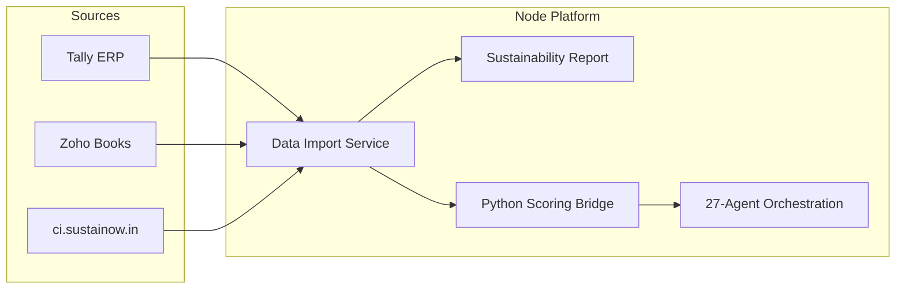

# Data Connectors & Carbon Intelligence

Import MSME financial data from **Tally** or **Zoho Books**, enrich with **Sustainow Carbon Intelligence** (ci.sustainow.in), and calculate the 20-dimension Financial Health Score.

## Architecture



## Connectors

| Connector | Demo mode | Live configuration |
|---|---|---|
| **Tally ERP** | Always available | `TALLY_API_URL` + `TALLY_API_KEY` |
| **Zoho Books** | Always available | `ZOHO_CLIENT_ID`, `ZOHO_CLIENT_SECRET`, `ZOHO_REFRESH_TOKEN`, `ZOHO_ORGANIZATION_ID` |
| **Carbon Intelligence** | When no API key | `CARBON_INTELLIGENCE_API_KEY` |

List connectors: `GET /api/v1/integrations/connectors`

## Carbon Intelligence (ci.sustainow.in)

Partner API endpoints used:

| Endpoint | Purpose |
|---|---|
| `GET /v1/public/integration-catalog` | API catalog & auth docs |
| `GET /v1/partners/msmes/:id/carbon-summary` | Carbon footprint (Scope 1/2/3, intensity) |
| `GET /v1/partners/msmes/:id/transactions/summary` | Cash flow, payment behaviour, concentration |
| `GET /v1/partners/msmes/:id/reports/overview` | ESG reporting readiness, GHG alignment |

### Sustainability report

`GET /api/v1/integrations/carbon/{msme_id}/sustainability-report`

Composite **sustainability score** (0–100) derived from:
- Carbon transition risk (from intensity)
- Data completeness
- Reporting readiness (BRSR / GHG)
- Transition plan status
- Payment behaviour from transaction analytics

This feeds the scoring engine's **carbon_transition_risk** and **esg_disclosure** dimensions.

## API — Import & Assess

### Preview (no score)

```bash
POST /api/v1/msme/assess/import/preview
Authorization: Bearer <token>
Content-Type: application/json

{
  "connector": "tally",
  "include_carbon_intelligence": true,
  "options": { "to_date": "2026-03-31" }
}
```

### Full pipeline

```bash
POST /api/v1/msme/assess/import
```

1. Pull accounting data from Tally or Zoho
2. Fetch ci.sustainow.in carbon + transaction + reporting data
3. Build sustainability report
4. Merge into assessment request
5. Run Python 20-dimension scoring engine
6. Run 27-agent orchestration
7. Persist assessment + return score

### Standalone imports

| Method | Path | Description |
|---|---|---|
| `POST` | `/api/v1/integrations/tally/import` | Tally financial data only |
| `POST` | `/api/v1/integrations/zoho/import` | Zoho Books financial data only |
| `GET` | `/api/v1/integrations/carbon/{msme_id}` | Full CI intelligence bundle |
| `GET` | `/api/v1/integrations/carbon/catalog` | CI partner API catalog |

## MSME Portal

**Import Data** page: `/app/msme/import.html`

1. Select Tally or Zoho
2. Preview imported P&L, cash flows, and sustainability metrics
3. Run full Financial Health Score calculation

## Why Python bridge for scoring?

The scoring engine (`app/services/scoring_engine.py`) remains in Python. Imported data is passed to `scoring_bridge.py` together with Carbon Intelligence payloads — same path as manual assessments. See [NODE_PLATFORM.md](./NODE_PLATFORM.md).

## Environment

```env
CARBON_INTELLIGENCE_API_KEY=ci_live_...
TALLY_API_URL=https://your-tally-gateway.example.com
TALLY_API_KEY=...
ZOHO_CLIENT_ID=...
ZOHO_REFRESH_TOKEN=...
ZOHO_ORGANIZATION_ID=...
```

Without keys, all connectors run in **demo mode** with realistic sample data for Shree Ganesh Auto Components.
