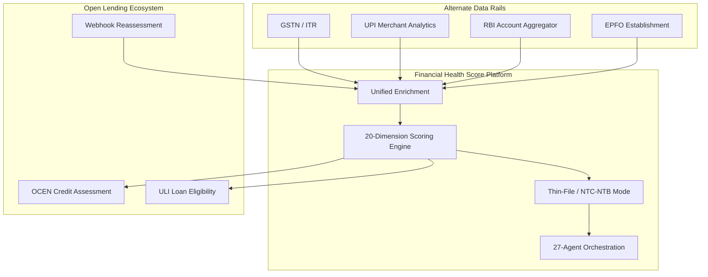

# MSME Financial Health Card — Ecosystem Integration

The platform implements the **MSME Financial Health Card** pattern: unified aggregation of alternate data (GST, UPI, Account Aggregator, EPFO), multidimensional AI/ML scoring, OCEN/ULI ecosystem adapters, and near-real-time credit reassessment for **New-to-Credit (NTC)** and **New-to-Bank (NTB)** enterprises.

## Architecture



## Alternate Data Connectors

List all connectors:

```bash
GET /api/v1/integrations/alternate-data/connectors
```

| Connector | Source | Scoring impact | Env vars |
|---|---|---|---|
| **GSTN / ITR** | Tax filing compliance | `tax_compliance`, `government_policy_alignment` | `TAX_API_KEY` |
| **Account Aggregator** | Consented bank statements | `alternative_data_signals`, `cash_flow_health`, `payment_behaviour` | `ACCOUNT_AGGREGATOR_API_KEY` |
| **UPI Analytics** | Merchant payment velocity | `alternative_data_signals`, `cash_flow_health` | `UPI_ANALYTICS_API_KEY` |
| **EPFO** | Employment & wage compliance | `alternative_data_signals`, `operational_stability` | `EPFO_API_KEY` |

Mock mode is the default when API keys are unset (`USE_MOCK_INTEGRATIONS=true`).

### Account Aggregator (RBI AA Framework)

**1. Initiate consent**

```bash
POST /api/v1/ecosystem/aa/consent/initiate
Authorization: Bearer <msme-jwt>
Content-Type: application/json

{
  "msme_id": "msme-demo-001",
  "business_name": "Shree Ganesh Auto Components Pvt Ltd",
  "pan": "AABCS1234F",
  "fi_types": ["DEPOSIT", "TERM_DEPOSIT"]
}
```

Response includes `session_id`, `consent_handle`, and `redirect_url` for the AA consent UI.

**2. Fetch consented data**

```bash
POST /api/v1/ecosystem/aa/consent/fetch
Authorization: Bearer <msme-jwt>
Content-Type: application/json

{
  "session_id": "aa-msme-demo-001-abc123",
  "msme_id": "msme-demo-001",
  "include_upi": true,
  "include_epfo": true
}
```

**3. List consent sessions**

```bash
GET /api/v1/ecosystem/aa/consent/sessions?msme_id=msme-demo-001
Authorization: Bearer <msme-jwt>
```

### UPI Merchant Analytics

```bash
POST /api/v1/integrations/upi/analytics
Authorization: Bearer <jwt>
Content-Type: application/json

{ "msme_id": "msme-demo-001", "vpa": "merchant.demo@upi" }
```

Signals: monthly transaction volume, ticket size, payment success rate, MoM growth, unique payers.

### EPFO Establishment Compliance

```bash
POST /api/v1/integrations/epfo/verify
Authorization: Bearer <jwt>
Content-Type: application/json

{ "msme_id": "msme-demo-001", "establishment_id": "EPFO-DEMO001" }
```

Signals: employee count, contribution compliance %, months contributed, wage regularity.

## Unified Enrichment

When `auto_enrich: true` (default on `POST /api/v1/assess`), the enrichment pipeline pulls:

1. CIBIL/CRISIL bureau data (from GSTIN/PAN)
2. GSTN/ITR tax verification
3. Account Aggregator data (when `aa_session_id` provided)
4. UPI analytics (when `include_upi: true`)
5. EPFO compliance (when `include_epfo: true`)

Implementation: `server/src/services/integrations/enrichment.ts`

### Assessment request with alternate data

```json
{
  "financial_data": {
    "profile": {
      "msme_id": "msme-demo-001",
      "business_name": "Demo MSME",
      "gstin": "27AABCS1234F1Z5",
      "borrower_segment": "NTC_NTB"
    },
    "accounting": { "revenue_inr": 48000000 }
  },
  "auto_enrich": true,
  "thin_file_mode": true,
  "alternate_data": {
    "include_aa": true,
    "include_upi": true,
    "include_epfo": true,
    "aa_session_id": "aa-msme-demo-001-abc123"
  },
  "audience": "credit_team"
}
```

## Thin-File / NTC / NTB Scoring

Borrower segmentation is automatic or can be forced via `profile.borrower_segment`:

| Segment | Condition | Scoring mode |
|---|---|---|
| `standard` | Bureau history + bank relationship | Standard weights |
| `NTC` | No credit bureau history | Thin-file weights |
| `NTB` | No established bank relationship | Thin-file weights |
| `NTC_NTB` | Neither bureau nor bank relationship | Thin-file weights |

### Weight adjustment (thin-file mode)

When thin-file scoring is active, dimension weights are rebalanced:

| Dimension | Adjustment |
|---|---|
| Alternative Data Signals | +3% |
| Tax Compliance | +2% |
| Cash Flow Health | +2% |
| Payment Behaviour | +1.5% |
| Operational Stability | +1% |
| Credit History & Debt Servicing | −5% |
| Peer Benchmark | −1.5% |

Weights are renormalized to 100%. Implementation: `server/src/services/scoring/thin-file.ts`

### Assessment metadata

Every assessment includes borrower segment in `metadata`:

```json
{
  "metadata": {
    "borrower_segment": "NTC_NTB",
    "thin_file_scoring": true,
    "alternate_data_sources": ["gst", "upi", "account_aggregator", "epfo"],
    "weight_adjustments": {
      "alternative_data_signals": { "from": 0.05, "to": 0.08 },
      "credit_history_debt_servicing": { "from": 0.06, "to": 0.01 }
    }
  }
}
```

## OCEN — Open Credit Enablement Network

**Catalog:** `GET /api/v1/ecosystem/catalog`

**Credit assessment product:** `POST /api/v1/ecosystem/ocen/credit-assessment`

```bash
curl -X POST http://localhost:8080/api/v1/ecosystem/ocen/credit-assessment \
  -H "Content-Type: application/json" \
  -d '{
    "borrower": {
      "msme_id": "msme-demo-001",
      "business_name": "Shree Ganesh Auto Components Pvt Ltd",
      "gstin": "27AABCS1234F1Z5"
    },
    "assessment_options": {
      "thin_file_mode": true,
      "include_alternate_data": true
    }
  }'
```

**Response shape:**

```json
{
  "protocol": "OCEN",
  "version": "1.0",
  "product_id": "FHS-MSME-HEALTH-CARD-v1",
  "credit_decision": {
    "financial_health_score": 72.4,
    "grade": "B+",
    "risk_level": "low",
    "recommended_action": "ENHANCED_DUE_DILIGENCE"
  },
  "borrower_segment": {
    "segment": "NTC_NTB",
    "is_thin_file": true,
    "alternate_data_coverage": ["gst", "upi", "epfo"]
  },
  "alternate_data_sources": ["gst", "upi", "epfo"],
  "ocen_metadata": {
    "assessment_type": "MSME_FINANCIAL_HEALTH_CARD",
    "real_time_capable": true
  }
}
```

## ULI — Unified Lending Interface

**Loan eligibility:** `POST /api/v1/ecosystem/uli/loan-eligibility`

```bash
curl -X POST http://localhost:8080/api/v1/ecosystem/uli/loan-eligibility \
  -H "Content-Type: application/json" \
  -d '{
    "msme_id": "msme-demo-001",
    "loan_amount_inr": 2500000,
    "tenure_months": 36,
    "auto_enrich": true
  }'
```

Returns eligibility, max eligible amount, recommended rate band, and conditions (including thin-file requirements).

## Near-Real-Time Reassessment

Webhook endpoint for alternate-data updates:

```bash
POST /api/v1/webhooks/alternate-data
Content-Type: application/json
X-Webhook-Secret: <WEBHOOK_SECRET>   # optional, when configured

{
  "event_type": "upi.analytics.refresh",
  "msme_id": "msme-demo-001",
  "source": "upi"
}
```

### Supported events

| Event | Source | Trigger |
|---|---|---|
| `gst.filing.updated` | `gst` | New GST return filed |
| `aa.statement.received` | `account_aggregator` | New bank statement via AA |
| `upi.analytics.refresh` | `upi` | UPI merchant data refresh |
| `epfo.contribution.posted` | `epfo` | New EPFO contribution |

The pipeline:

1. Records webhook event in `webhook_events` table
2. Enriches MSME profile with updated alternate data
3. Runs thin-file-aware FHS reassessment
4. Persists new assessment
5. Returns `assessment_id` and updated score

**View events (MSME):** `GET /api/v1/msme/reassessment-events`

## Enterprise Portal Workflow

On the **Credit Assessment** page (`/app/msme/assess`):

1. **Initiate Credit Assessment** — standard 20-dimension FHS with Carbon Intelligence
2. **NTC/NTB Alternate-Data Assessment** — aggregates GST, UPI, AA, EPFO with thin-file scoring

Both paths run 27-agent orchestration and persist assessments.

## Environment Variables

```env
# Account Aggregator
ACCOUNT_AGGREGATOR_API_KEY=
ACCOUNT_AGGREGATOR_BASE_URL=https://api.accountaggregator.ndml.in
AA_CONSENT_REDIRECT_URL=https://consent.accountaggregator.example/authorize

# UPI
UPI_ANALYTICS_API_KEY=
UPI_ANALYTICS_BASE_URL=https://api.upi-analytics.example

# EPFO
EPFO_API_KEY=
EPFO_BASE_URL=https://api.epfo.gov.in

# Webhook authentication
WEBHOOK_SECRET=

# Mock mode (default)
USE_MOCK_INTEGRATIONS=true
```

## Related Documentation

- [API.md](./API.md) — full endpoint reference
- [SCORING.md](./SCORING.md) — dimension weights and thin-file mode
- [DATA_CONNECTORS.md](./DATA_CONNECTORS.md) — ERP + carbon import pipeline
- [ARCHITECTURE.md](./ARCHITECTURE.md) — system context and component map
