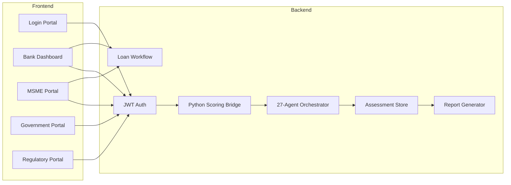

# Platform — Multi-Stakeholder Portals

Full-stack Financial Health Score platform with JWT authentication, role-based access, **27-agent orchestration**, assessment persistence, loan workflow, and detailed HTML credit reports.

**Runtime:** Node.js Express v2.1 (`cd server && npm run dev`)

## Access

| Portal | URL |
|---|---|
| **Login** | http://localhost:8080/app/index.html |
| **Bank Dashboard** | http://localhost:8080/app/bank/dashboard.html |
| **MSME Portal** | http://localhost:8080/app/msme/dashboard.html |
| **Government Portal** | http://localhost:8080/app/govt/dashboard.html |
| **Regulatory Portal** | http://localhost:8080/app/regulatory/dashboard.html |
| **API Reference** | [API.md](./API.md) |

## Demo Login Credentials

### Bank (IDBI MSME Lending)

| Email | Password | Role |
|---|---|---|
| `admin@idbi.bank.in` | `IDBI@2026` | Bank Admin |
| `credit@idbi.bank.in` | `IDBI@2026` | Credit Team |
| `risk@idbi.bank.in` | `IDBI@2026` | Risk Team |
| `rm@idbi.bank.in` | `IDBI@2026` | Relationship Manager |

### MSME

| Email | Password | Business |
|---|---|---|
| `rajesh@shreeganesh.in` | `MSME@2026` | Shree Ganesh Auto Components |
| `founder@greenfab.in` | `MSME@2026` | GreenFab Textiles LLP |

### Government

| Email | Password | Role |
|---|---|---|
| `admin@msme.gov.in` | `GOVT@2026` | MSME Ministry Admin |
| `schemes@msme.gov.in` | `GOVT@2026` | Scheme Officer |
| `officer@sidbi.in` | `GOVT@2026` | SIDBI Officer |

### Regulatory

| Email | Password | Role |
|---|---|---|
| `supervisor@rbi.org.in` | `REG@2026` | RBI Supervisor |
| `compliance@gstn.gov.in` | `REG@2026` | GSTN Compliance Officer |
| `filings@mca.gov.in` | `REG@2026` | MCA Filing Officer |
| `nbfc@rbi.org.in` | `REG@2026` | NBFC Reviewer |

Retrieve all credentials via API: `GET /api/v1/auth/demo-credentials`  
Snapshot: `tests/snapshots/demo_credentials.json`

## User Roles

| Role | Access |
|---|---|
| `bank_admin` | Full portfolio, assessments, loan decisions |
| `bank_credit` | Credit-focused assessments and reports |
| `bank_risk` | Risk-focused assessments |
| `bank_rm` | Portfolio and relationship management |
| `msme_owner` | Self-assessment, reports, loan applications |
| `msme_viewer` | Read-only dashboard and reports |
| `govt_admin` | MSME registry, scheme recommendations |
| `govt_scheme_officer` | Scheme catalog and applications |
| `reg_rbi_supervisor` | Regulatory dashboard and compliance review |
| `reg_gstn_officer` / `reg_mca_officer` | Sector-specific regulatory review |

## Platform Services



### Authentication (`/api/v1/auth`)

| Method | Path | Description |
|---|---|---|
| `POST` | `/login` | Email/password login → JWT |
| `GET` | `/me` | Current user profile |
| `GET` | `/demo-credentials` | Demo login list (all stakeholders) |

### Bank (`/api/v1/bank`)

| Method | Path | Description |
|---|---|---|
| `GET` | `/dashboard` | Portfolio stats |
| `GET` | `/portfolio` | MSME list with latest scores |
| `GET` | `/assessments` | Assessment history |
| `POST` | `/assess/{msme_id}` | Run assessment + agent orchestration |
| `GET` | `/loans` | Loan applications |

### MSME (`/api/v1/msme`)

| Method | Path | Description |
|---|---|---|
| `GET` | `/dashboard` | Score summary and stats |
| `GET` | `/assessments` | Assessment history |
| `POST` | `/assess/quick` | Quick assessment + 27-agent orchestration |
| `POST` | `/loans` | Submit loan application |

### Government (`/api/v1/govt`)

| Method | Path | Description |
|---|---|---|
| `GET` | `/dashboard` | Registered MSMEs, average scores |
| `GET` | `/schemes/catalog` | Available scheme codes |
| `POST` | `/schemes/recommend/{msme_id}` | Policy advisory agent |
| `GET` | `/scheme-applications` | Application list |

### Regulatory (`/api/v1/regulatory`)

| Method | Path | Description |
|---|---|---|
| `GET` | `/dashboard` | Submissions, high-risk assessments |
| `POST` | `/review/{msme_id}` | Regulatory compliance agent review |

### Agentic AI (`/api/v1/agents`)

| Method | Path | Description |
|---|---|---|
| `GET` | `/architecture` | Orchestration metadata (public) |
| `GET` | `/status` | Agent run log |
| `POST` | `/orchestrate/{assessment_id}` | Re-run orchestration |
| `GET` | `/orchestration/{orchestration_id}` | Retrieve result |
| `GET` | `/dimension/{dimension_id}` | Single dimension agent output |

See [AGENTIC_ARCHITECTURE.md](./AGENTIC_ARCHITECTURE.md).

### Reports (`/api/v1/reports`)

| Method | Path | Description |
|---|---|---|
| `GET` | `/{assessment_id}` | Detailed JSON report with agent orchestration |
| `GET` | `/{assessment_id}/html` | Printable HTML credit assessment report |

## Detailed Report Output

Each stored assessment produces a **Detailed Credit Assessment Report** containing:

1. **Executive Summary** — overall score, grade, confidence, strongest/weakest dimensions
2. **Credit Decision Recommendation** — APPROVE / CONDITIONAL / ENHANCED DD / DECLINE
3. **Agent Orchestration** — 27-agent synthesis (risk, health score, reporting)
4. **20-Dimension Score Breakdown** — score, weight, risk, confidence per dimension
5. **Risk Indicators** — severity, evidence, recommended actions
6. **Key Insights** — evidence-linked narratives
7. **Data Gaps** — missing fields and remediation
8. **Recommended Improvements** — actionable MSME guidance
9. **Green Finance Opportunities** — sustainability-linked lending options
10. **Carbon Intelligence Summary** — emissions and transition metrics

Access via portal **Report** button, or API endpoints above.

## Database

SQLite database at `data/financial_health_node.db` (configurable via `DATABASE_URL`).

Tables: `organizations`, `users`, `portfolio_links`, `assessment_records`, `loan_applications`, `scheme_applications`, `regulatory_submissions`, `agent_runs`, `notifications`.

Seeded on startup with IDBI bank, portfolio MSMEs, and demo users across all four stakeholder types.

## Configuration

```env
SECRET_KEY=your-secret-key
JWT_EXPIRE_MINUTES=480
DATABASE_URL=data/financial_health_node.db
OPENAI_API_KEY=              # Optional — LLM agent narratives
USE_MOCK_INTEGRATIONS=true
```
