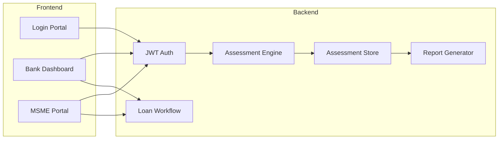

# Platform — Bank & MSME Portals

Full-stack Financial Health Score platform with JWT authentication, role-based access, assessment persistence, loan workflow, and detailed HTML credit reports.

## Access

| Portal | URL |
|---|---|
| **Login** | http://localhost:8080/app/index.html |
| **Bank Dashboard** | http://localhost:8080/app/bank/dashboard.html |
| **MSME Portal** | http://localhost:8080/app/msme/dashboard.html |
| **API Docs** | http://localhost:8080/docs |

## Demo Login Credentials

### Bank (IDBI MSME Lending)

| Email | Password | Role |
|---|---|---|
| `admin@idbi.bank.in` | `IDBI@2026` | Bank Admin |
| `credit@idbi.bank.in` | `IDBI@2026` | Credit Team |
| `risk@idbi.bank.in` | `IDBI@2026` | Risk Team |
| `rm@idbi.bank.in` | `IDBI@2026` | Relationship Manager |

### MSME

| Email | Password | Business |
|---|---|---|
| `rajesh@shreeganesh.in` | `MSME@2026` | Shree Ganesh Auto Components |
| `founder@greenfab.in` | `MSME@2026` | GreenFab Textiles LLP |
| `accounts@shreeganesh.in` | `MSME@2026` | Shree Ganesh (viewer only) |

Retrieve credentials via API: `GET /api/v1/auth/demo-credentials`

## User Roles

| Role | Access |
|---|---|
| `bank_admin` | Full portfolio, assessments, loan decisions |
| `bank_credit` | Credit-focused assessments and reports |
| `bank_risk` | Risk-focused assessments |
| `bank_rm` | Portfolio and relationship management |
| `msme_owner` | Self-assessment, reports, loan applications |
| `msme_viewer` | Read-only dashboard and reports |

## Platform Services



### Authentication (`/api/v1/auth`)

| Method | Path | Description |
|---|---|---|
| `POST` | `/login` | Email/password login → JWT |
| `GET` | `/me` | Current user profile |
| `POST` | `/register` | MSME self-registration |
| `GET` | `/demo-credentials` | Demo login list |

### Bank (`/api/v1/bank`)

| Method | Path | Description |
|---|---|---|
| `GET` | `/dashboard` | Portfolio stats |
| `GET` | `/portfolio` | MSME list with latest scores |
| `GET` | `/assessments` | Assessment history |
| `POST` | `/assess/{msme_id}` | Run assessment for portfolio MSME |
| `GET` | `/loans` | Loan applications |
| `PATCH` | `/loans/{id}` | Approve/reject/review loans |

### MSME (`/api/v1/msme`)

| Method | Path | Description |
|---|---|---|
| `GET` | `/dashboard` | Score summary and stats |
| `GET` | `/assessments` | Assessment history |
| `POST` | `/assess` | Full custom assessment |
| `POST` | `/assess/quick` | Quick assessment with profile data |
| `POST` | `/loans` | Submit loan application |
| `GET` | `/loans` | View own applications |

### Reports (`/api/v1/reports`)

| Method | Path | Description |
|---|---|---|
| `GET` | `/{assessment_id}` | Detailed JSON report with credit recommendation |
| `GET` | `/{assessment_id}/html` | Printable HTML credit assessment report |

## Detailed Report Output

Each stored assessment produces a **Detailed Credit Assessment Report** containing:

1. **Executive Summary** — overall score, grade, confidence, strongest/weakest dimensions
2. **Credit Decision Recommendation** — APPROVE / CONDITIONAL / ENHANCED DD / DECLINE
3. **20-Dimension Score Breakdown** — score, weight, risk, confidence per dimension
4. **Risk Indicators** — severity, evidence, recommended actions
5. **Key Insights** — evidence-linked narratives
6. **Data Gaps** — missing fields and remediation
7. **Recommended Improvements** — actionable MSME guidance
8. **Green Finance Opportunities** — sustainability-linked lending options
9. **Carbon Intelligence Summary** — emissions and transition metrics

Access via bank or MSME portal **Report** button, or API endpoints above.

## Database

SQLite database at `data/financial_health.db` (configurable via `DATABASE_URL`).

Tables: `organizations`, `users`, `portfolio_links`, `assessment_records`, `loan_applications`, `notifications`.

Seeded on startup with IDBI bank, 3 portfolio MSMEs, and demo users.

## Configuration

```env
SECRET_KEY=your-secret-key
JWT_EXPIRE_MINUTES=480
DATABASE_URL=sqlite:///./data/financial_health.db
FRONTEND_URL=http://localhost:8080
```
