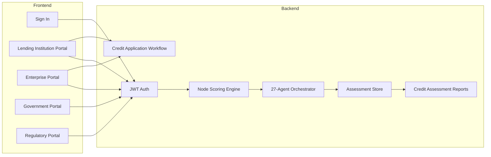

# Platform — Multi-Stakeholder Portals

Full-stack Financial Health Score (FHS) platform with JWT authentication, role-based access, **27-agent orchestration**, credit assessment persistence, credit facility workflow, and detailed HTML credit assessment reports.

**Runtime:** Node.js Express v2.1 (`cd server && npm run dev`)

UI copy uses formal banking and MSME terminology. See [TERMINOLOGY.md](./TERMINOLOGY.md).

## Access

| Portal | URL | Description |
|---|---|---|
| **Sign In** | http://localhost:8080/app/index.html | Stakeholder authentication |
| **Lending Institution** | http://localhost:8080/app/bank/dashboard.html | Executive dashboard, lending portfolio, credit applications |
| **Enterprise (MSME)** | http://localhost:8080/app/msme/dashboard.html | Enterprise dashboard, credit assessment, registration |
| **Government** | http://localhost:8080/app/govt/dashboard.html | National MSME registry & scheme advisory |
| **Regulatory** | http://localhost:8080/app/regulatory/dashboard.html | Supervisory dashboard & compliance review |
| **API Reference** | [API.md](./API.md) | REST endpoint reference |

## Demo Login Credentials

### Lending Institution (IDBI MSME Lending)

| Email | Password | Role (display) |
|---|---|---|
| `admin@idbi.bank.in` | `IDBI@2026` | Bank Administrator |
| `credit@idbi.bank.in` | `IDBI@2026` | Credit Analyst |
| `risk@idbi.bank.in` | `IDBI@2026` | Risk Officer |
| `rm@idbi.bank.in` | `IDBI@2026` | Relationship Manager |

### Enterprise (MSME)

| Email | Password | Enterprise |
|---|---|---|
| `rajesh@shreeganesh.in` | `MSME@2026` | Shree Ganesh Auto Components |
| `founder@greenfab.in` | `MSME@2026` | GreenFab Textiles LLP |

New enterprises can self-register at `/app/msme/register.html` (3-step onboarding wizard).

### Government

| Email | Password | Role (display) |
|---|---|---|
| `admin@msme.gov.in` | `GOVT@2026` | Ministry Administrator |
| `schemes@msme.gov.in` | `GOVT@2026` | Scheme Officer |
| `officer@sidbi.in` | `GOVT@2026` | SIDBI Credit Officer |

### Regulatory

| Email | Password | Role (display) |
|---|---|---|
| `supervisor@rbi.org.in` | `REG@2026` | RBI Supervisory Officer |
| `compliance@gstn.gov.in` | `REG@2026` | GSTN Compliance Officer |
| `filings@mca.gov.in` | `REG@2026` | MCA Filing Officer |
| `nbfc@rbi.org.in` | `REG@2026` | NBFC Credit Reviewer |

Retrieve all credentials via API: `GET /api/v1/auth/demo-credentials`  
Snapshot: `tests/snapshots/demo_credentials.json`

## User Roles

| Role | Access |
|---|---|
| `bank_admin` | Full lending portfolio, credit assessments, application decisions |
| `credit_team` | Credit-focused assessments and credit assessment reports |
| `risk_team` | Risk-focused assessments and elevated-risk monitoring |
| `relationship_manager` | Lending portfolio and borrower relationship management |
| `msme_owner` | Credit assessment, reports, credit facility applications, financial data submission |
| `msme_viewer` | Read-only enterprise dashboard and reports |
| `govt_admin` | National MSME registry, scheme advisory |
| `scheme_officer` | Schemes catalogue and applications |
| `reg_rbi_supervisor` | Regulatory supervisory dashboard and compliance review |
| `reg_gstn_officer` / `reg_mca_officer` | Sector-specific regulatory review |

## Platform Services



### Authentication (`/api/v1/auth`)

| Method | Path | Description |
|---|---|---|
| `POST` | `/login` | Email/password login → JWT |
| `GET` | `/me` | Current user profile |
| `GET` | `/demo-credentials` | Demo login list (all stakeholders) |

### Lending Institution (`/api/v1/bank`)

| Method | Path | Description |
|---|---|---|
| `GET` | `/dashboard` | Executive dashboard stats |
| `GET` | `/portfolio` | MSME lending portfolio with latest FHS |
| `GET` | `/assessments` | Credit assessment history |
| `POST` | `/assess/{msme_id}` | Initiate credit assessment + agent orchestration |
| `GET` | `/loans` | Credit facility applications |
| `PATCH` | `/loans/{loan_id}` | Sanction / decline / update application status |

### Enterprise (`/api/v1/msme`)

| Method | Path | Description |
|---|---|---|
| `GET` | `/dashboard` | FHS summary and enterprise stats |
| `GET` | `/profile` | Enterprise profile & financial statements |
| `POST` | `/data-feed` | Submit financial data + optional FHS recalculation |
| `GET` | `/assessments` | Credit assessment history |
| `POST` | `/assess/quick` | Initiate credit assessment + 27-agent orchestration |
| `POST` | `/assess/import` | ERP data integration + credit assessment |
| `POST` | `/loans` | Submit credit facility application |

### Government (`/api/v1/govt`)

| Method | Path | Description |
|---|---|---|
| `GET` | `/dashboard` | Registered MSMEs, average scores |
| `GET` | `/schemes/catalog` | Available scheme codes |
| `POST` | `/schemes/recommend/{msme_id}` | Policy advisory agent |
| `GET` | `/scheme-applications` | Application list |

### Regulatory (`/api/v1/regulatory`)

| Method | Path | Description |
|---|---|---|
| `GET` | `/dashboard` | Submissions, high-risk assessments |
| `POST` | `/review/{msme_id}` | Regulatory compliance agent review |

### Agentic AI (`/api/v1/agents`)

| Method | Path | Description |
|---|---|---|
| `GET` | `/architecture` | Orchestration metadata (public) |
| `GET` | `/status` | Agent run log |
| `POST` | `/orchestrate/{assessment_id}` | Re-run orchestration |
| `GET` | `/orchestration/{orchestration_id}` | Retrieve result |
| `GET` | `/dimension/{dimension_id}` | Single dimension agent output |

See [AGENTIC_ARCHITECTURE.md](./AGENTIC_ARCHITECTURE.md).  
Terminology: [TERMINOLOGY.md](./TERMINOLOGY.md).

### Reports (`/api/v1/reports`)

| Method | Path | Description |
|---|---|---|
| `GET` | `/{assessment_id}` | Detailed JSON report with agent orchestration |
| `GET` | `/{assessment_id}/html` | Printable HTML credit assessment report |

## Detailed Report Output

Each stored assessment produces a **Credit Assessment Report** containing:

1. **Executive Summary** — FHS, credit grade, confidence, key credit strengths and weaknesses
2. **Credit Decision Recommendation** — APPROVE / CONDITIONAL / ENHANCED DD / DECLINE
3. **Agent Orchestration** — 27-agent synthesis (risk, FHS validation, reporting)
4. **20-Dimension Credit Analysis** — score, weight, risk rating, confidence per dimension
5. **Risk Indicators** — severity, evidence, recommended actions
6. **Key Insights** — evidence-linked narratives
7. **Data Gaps** — missing fields and remediation
8. **Recommended Credit Improvement Actions** — actionable enterprise guidance
9. **Green Finance Opportunities** — ESG-linked lending options
10. **Carbon Intelligence Summary** — emissions and transition metrics

Access via portal **Credit Assessment Report** view, or API endpoints above.

## Database

SQLite database at `data/financial_health_node.db` (configurable via `DATABASE_URL`).

Tables: `organizations`, `users`, `msme_profiles`, `msme_data_feeds`, `portfolio_links`, `assessment_records`, `loan_applications`, `scheme_applications`, `regulatory_submissions`, `agent_runs`, `notifications`.

Seeded on startup with IDBI bank, portfolio MSMEs, and demo users across all four stakeholder types.

## Configuration

```env
SECRET_KEY=your-secret-key
JWT_EXPIRE_MINUTES=480
DATABASE_URL=data/financial_health_node.db
OPENAI_API_KEY=              # Optional — LLM agent narratives
USE_MOCK_INTEGRATIONS=true
```
